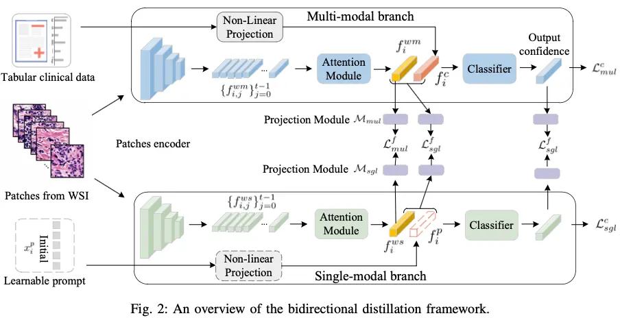
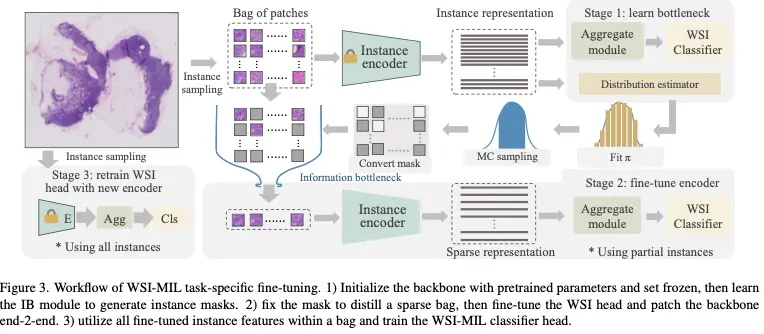
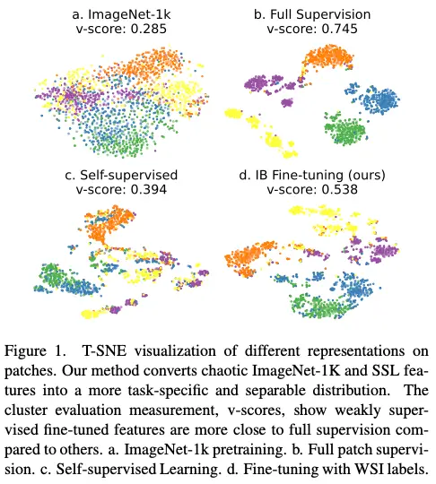

The gigapixel scale of Whole Slide Images (WSI), the chronic absence of clinical multimodal data, and the "compute wall" for fine-tuning large models constitute the "Three Major Hurdles" restricting the development of high-precision pathological AI.

This project reconstructs the computational paradigm of pathological image analysis across three dimensions: **low-rank architectural breakthroughs**, **robust fusion mechanisms for missing modalities**, and **task-specific efficient fine-tuning**.

## 1. Breaking the "Low-Rank" Bottleneck in Long Sequences (LongMIL)

**Original Paper:** *Rethinking Transformer for Long Contextual Histopathology Whole Slide Image Analysis* (NeurIPS 2024)
 **Authors:** Honglin Li, Yunlong Zhang, Pingyi Chen, Zhongyi Shui, Chenglu Zhu, Lin Yang

### The Scientific Question: The Transformer's "Achilles' Heel" in WSI

When processing WSIs containing tens of thousands of patches, traditional Transformers face two critical challenges:
1.  **Explosive Complexity:** The $O(N^2)$ complexity of standard Self-Attention makes memory usage unsustainable.
2.  **Low-Rank Bottleneck:** We theoretically revealed that when sequence length $N$ far exceeds embedding dimension $D$, the attention matrix exhibits mathematical "low-rank" properties. This means attention maps become homogenized, failing to capture fine-grained local microenvironmental differences.

### Core Method: Local-Global Hybrid Attention

To break the rank limit and reduce computation, we propose the **LongMIL** architecture:

* **Local Attention Mask:** By introducing local window constraints, we force the model to focus on interactions within local neighborhoods. Theory proves this sparsification significantly increases the **Rank** of the attention matrix.
* **Linear Complexity:** Utilizing a Chunked Computation strategy reduces complexity from quadratic $O(N^2)$ to linear $O(N \times w)$ (where $w$ is window size).
* **Dual-Stream Architecture:** A "Local-First, Global-Second" design captures cell community features before aggregating slide-level information.

### Results
**Table1**



Method,ViT-S Lunit [36] F1,ViT-S Lunit [36] AUC,ViT-S DINO (our pre-train) F1,ViT-S DINO (our pre-train) AUC
KNN (Mean),0.503 ± 0.011,0.691 ± 0.007,0.430 ± 0.029,0.649 ± 0.008
KNN (Max),0.472 ± 0.009,0.771 ± 0.018,0.416 ± 0.019,0.645 ± 0.007
Mean-pooling,0.534 ± 0.026,0.741 ± 0.017,0.487 ± 0.034,0.717 ± 0.020
Max-pooling,0.649 ± 0.032,0.843 ± 0.018,0.598 ± 0.032,0.818 ± 0.006
AB-MIL [32],0.668 ± 0.032,0.866 ± 0.016,0.621 ± 0.048,0.837 ± 0.035
DS-MIL [40],0.607 ± 0.044,0.824 ± 0.028,0.622 ± 0.063,0.808 ± 0.033
CLAM-SB [50],0.647 ± 0.020,0.836 ± 0.021,0.627 ± 0.032,0.836 ± 0.009
DTFD-MIL MaxS [89],0.597 ± 0.025,0.874 ± 0.026,0.521 ± 0.059,0.807 ± 0.016
DTFD-MIL AFS [89],0.608 ± 0.083,0.869 ± 0.018,0.538 ± 0.053,0.824 ± 0.011
TransMIL [65],0.648 ± 0.054,0.835 ± 0.031,0.591 ± 0.049,0.798 ± 0.029
Full Attention,0.689 ± 0.036,0.870 ± 0.010,0.648 ± 0.028,0.839 ± 0.018
LongMIL (ours),0.706 ± 0.025,0.888 ± 0.019,0.657 ± 0.026,0.848 ± 0.004



Table 1: Slide-Level Survival Prediction based on HIPT [9] pre-trained embedding with variousWSI-MIL architectures including vanilla attention, GCN, TransllL, self-attention (HIPT with regionslicing and absolute embedding), full self-attention and our LongMl.

**Table 2**


Method,COADREAD,STAD,BRCA
AB-MIL [32],0.566 ± 0.075,0.562 ± 0.049,0.549 ± 0.057
AMISL [86],0.561 ± 0.088,0.563 ± 0.067,0.545 ± 0.071
DS-MIL [40],0.470 ± 0.053,0.546 ± 0.047,0.548 ± 0.058
GCN-MIL [43],0.538 ± 0.049,0.513 ± 0.069,-
HIPT [9],<u>0.608 ± 0.088</u>,0.570 ± 0.081,-
TransMIL [65],0.597 ± 0.134,0.564 ± 0.080,0.587 ± 0.063
Full Attention,0.603 ± 0.048,<u>0.568 ± 0.074</u>,<u>0.601 ± 0.047</u>
LongMIL (ours),0.624 ± 0.057,0.589 ± 0.066,0.619 ± 0.053



Table 2: Slide-Level Tumor Subtyping on BRACS by using two pre-trained embeddings. Top Rows.Various WSI-MI architectures with vanilla attention (no interaction among different instances)Bottom Rows. TransMlL, (using Nyströmformer and learnable absolute position embedding), fullattention (+RoPE) and our LongMIL.

On **BRACS** and **TCGA-BRCA** datasets:
* **Performance:** F1-score reached **0.657** on BRACS tumor typing, significantly outperforming SOTA methods like TransMIL.
* **Extrapolation:** In "train small, test large" experiments, LongMIL showed strong robustness (p-value $\approx$ 0.1), proving its adaptability to varying WSI sizes.

---

## 2. Feature Mining under Weak Supervision: Attention-Challenging MIL (ACMIL)

**Original Paper:** *Attention-Challenging Multiple Instance Learning for Whole Slide Image Classification* (ECCV 2024)
 **Authors:** Yunlong Zhang, Honglin Li, Yunxuan Sun, Sunyi Zheng, Chenglu Zhu, Lin Yang

### The Scientific Question: Attention "Laziness"

In Weakly Supervised Multiple Instance Learning (MIL), models tend to focus only on the most obvious discriminative regions (e.g., tumor cores), ignoring edges or atypical key features. This "Attention Laziness" leads to poor generalization on heterogeneous tumors.

 & Figure 4: Motivation of STKIM.")

### Core Method: Adversarial Attention Enhancement

We propose the **ACMIL** framework to "manufacture difficulty" for the model:

* **Multi-Branch Attention (MBA):** Parallel attention branches capture distinct clustering patterns in the feature space (verified via UMAP), covering more diverse pathological features.
* **Stochastic Top-K Instance Masking (STKIM):** During training, we randomly "mask" the Top-K instances with the highest attention scores.

{}
**Mechanism:** Similar to Dropout but at the instance level, STKIM forces the model to hunt for sub-optimal discriminative features in the remaining instances, effectively preventing overfitting.
{}

 covering broader tumor regions than the baseline (left).")

### Results

* **Camelyon16:** Achieved an AUC of **0.954**, outperforming methods like DTFD-MIL.
* **TCGA-LBC:** AUC increased to **0.901** on liquid-based cytology data, proving effectiveness in sparse feature mining.

---

## 3. Addressing Missing Clinical Data: Bidirectional Distillation

**Original Paper:** *Multi-modal Learning with Missing Modality in Predicting Axillary Lymph Node Metastasis* (BIBM 2023)
 **Authors:** Shichuan Zhang, Sunyi Zheng, Zhongyi Shui, Honglin Li, Lin Yang

### The Scientific Question: The Multimodal "Bucket Effect"

In clinical practice, WSI and tabular data (genomics, clinical markers) are often asynchronous. Existing multimodal models often suffer a severe performance drop—sometimes below single-modal baselines—when clinical data is missing.

### Core Method: Bidirectional Distillation & Learnable Prompts

We propose a **Bidirectional Distillation (BD)** framework to teach the model how to handle missingness:

* **Decoupling:** Parallel "Single-Modal Branch" (WSI only) and "Multi-Modal Branch" (WSI + Clinical).
* **Learnable Prompt:** A learnable vector acts as a placeholder for missing modalities in the single-modal branch.
* **Bidirectional Distillation:** We distill fused knowledge from Multi $\to$ Single ($\mathcal{M} \to \mathcal{S}$) and distill pure image features back from Single $\to$ Multi ($\mathcal{S} \to \mathcal{M}$) to prevent noise interference.

### Results

In BCNB Breast Cancer Lymph Node Metastasis prediction:
* <mark>Resilience:</mark> With **80%-100%** clinical data missing, BD maintained an F1-score of **~74.9%**, while direct filling methods crashed to below 68%.

---

## 4. Low-Cost WSI Adaptation: Variational Information Bottleneck Fine-tuning

**Original Paper:** *Task-specific Fine-tuning via Variational Information Bottleneck for Weakly-supervised Pathology Whole Slide Image Classification* (CVPR 2023)
 **Authors:** Honglin Li, Chenglu Zhu, Yunlong Zhang, Yuxuan Sun, Zhongyi Shui, Wenwei Kuang, Sunyi Zheng, Lin Yang

### The Scientific Question: The WSI "Compute Wall"

Pathology models typically use ImageNet pre-trained backbones, which suffer from a domain gap. However, end-to-end full fine-tuning on WSIs (thousands of patches) requires VRAM far beyond standard GPU capabilities.

### Core Method: Sparse Critical Instance Selection

Based on **Variational Information Bottleneck (VIB)** theory, we screen for the "minimal sufficient statistics":

1.  **IB Module Screening:** A lightweight module selects the Top-K diagnostic instances (usually <1000) based on mutual information maximization.
2.  **Sparse Backpropagation:** Gradients are back-propagated **only** through selected instances during fine-tuning, reducing computational overhead by **>10x**.

### Results



Method,Camelyon-16 F1,Camelyon-16 AUC,TCGA-BRCA F1,TCGA-BRCA AUC,LBP-CECA F1,LBP-CECA AUC
Full Supervision,0.967±0.005,0.992±0.003,-,-,0.741±0.006,0.942±0.002
RNN-MIL [7],0.834±0.017,0.861±0.021,0.776±0.035,0.871±0.033,-,-
AB-MIL [19],0.828±0.013,0.851±0.025,0.771±0.040,0.869±0.037,0.525±0.017,0.845±0.002
DS-MIL [25],0.857±0.023,0.892±0.012,0.775±0.044,0.875±0.041,-,-
CLAM-SB [30],0.839±0.018,0.875±0.028,0.797±0.046,0.879±0.019,0.587±0.014,0.860±0.005
TransMIL [38],0.846±0.013,0.883±0.009,0.806±0.046,0.889±0.036,0.533±0.006,0.850±0.007
DTFD-MIL [45],0.882±0.008,0.932±0.016,0.816±0.045,0.895±0.042,0.569±0.026,0.847±0.003
FT+ CLAM-SB,0.911±0.017,0.956±0.013,0.845±0.032,0.935±0.027,0.718±0.010,0.907±0.005
FT+ TransMIL,0.923±0.012,0.967±0.003,0.848±0.044,0.945±0.020,0.720±0.024,0.918±0.004
FT+ DTFD-MIL,0.921±0.007,0.962±0.006,0.849±0.027,0.951±0.016,0.723±0.008,0.922±0.005
Mean-pooling,0.629±0.029,0.591±0.012,0.818±0.022,0.910±0.032,0.350±0.017,0.735±0.006
Max-pooling,0.805±0.012,0.824±0.016,0.644±0.179,0.826±0.096,0.636±0.064,0.893±0.019
KNN (Mean),0.468±0.000,0.506±0.000,0.633±0.066,0.749±0.055,0.393±0.000,0.650±0.000
KNN (Max),0.559±0.000,0.535±0.000,0.524±0.032,0.639±0.063,0.477±0.000,0.743±0.000
FT+ Mean-pooling,0.842±0.006,0.831±0.007,0.866±0.035,0.952±0.018,0.685±0.014,0.900±0.002
FT+ Max-pooling,0.927±0.011,0.969±0.004,0.852±0.043,0.948±0.019,0.695±0.013,0.912±0.004
FT+ KNN (Mean),0.505±0.000,0.526±0.000,0.784±0.044,0.907±0.034,0.529±0.000,0.737±0.000
FT+ KNN (Max),0.905±0.000,0.916±0.000,0.802±0.063,0.882±0.036,0.676±0.000,0.875±0.000



Table 3. Slide-Level Classification by using the IN-lK pre-trained backbone or the proposed fine-tuned (FT) in three datasets. Top RowsDifierent Mll, architectures are compared to select the top 3 $OTA methods to validate the transfer learning performance using the IN-lKbre-trained backbone or the FT, Bottom Rows. The competition of various traditional aggrcgalion and feature evaluation methods by usingore-trained IN-lK or the FT.

* **Performance Leap:** On Camelyon16, a VIB fine-tuned ResNet-50 with simple Max-pooling achieved an AUC of **0.969**, a **14.5%** jump over the ImageNet baseline (0.824).
* **Feature Space:** t-SNE visualization confirms significantly improved inter-class separation.

---

## Summary

This research directly targets the "compute" and "data" bottlenecks in pathological AI deployment.

* **LongMIL & ACMIL** reconstruct WSI attention mechanisms.
* **BD Framework** solves the pain point of missing clinical data.
* **VIB Fine-tuning** breaks the compute barrier for large-scale model optimization.

Together, these provide the core algorithmic support for building high-precision, low-cost, and robust pathological AI systems.