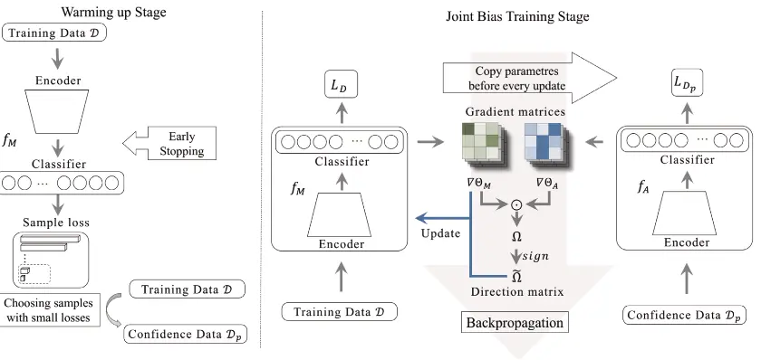
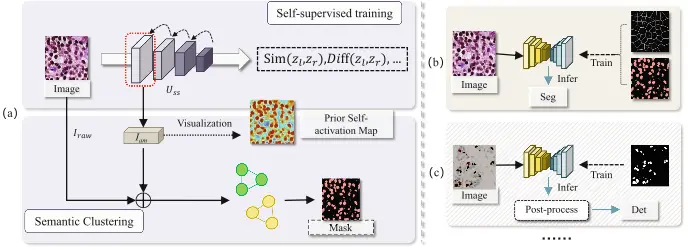

Clinical translation of pathological image analysis faces three fundamental theoretical hurdles: mixed data biases (co-occurring noise and long-tail distributions), cross-center domain shifts, and the need for unsupervised annotation.

This project addresses these issues through **gradient optimization dynamics**, **test-time adaptation mechanisms**, and **self-supervised representation mining**. Below, we detail our latest findings in gradient-aware decoupling (DAR), stable test-time training (Stable TTT), unsupervised cell recognition (PSM), and robustness benchmarking for pathological foundation models.

## 1. Gradient-Aware Decoupling for Mixed Data Bias (DAR)

**Original Paper:** *Gradient-aware learning for joint biases: Label noise and class imbalance* (Neural Networks 2024)
 **Authors:** Shichuan Zhang, Chenglu Zhu, Honglin Li, Jiatong Cai, Lin Yang

### The Challenge

Real-world pathological data rarely comes clean; it often suffers from simultaneous **label noise** and **class imbalance** (long-tail distribution). This "mixed bias" creates a conflict for traditional handling strategies. For instance, reweighting methods designed for class imbalance can inadvertently amplify the influence of noisy samples, causing the model to overfit incorrect labels and degrading performance.

### Our Approach

We observed that the feature extractor (Encoder) and the Classifier react differently to these biases: the Encoder is more sensitive to noise, while the Classifier is more sensitive to imbalance. Based on this, we developed the **Gradient-aware Decoupling and Regulation (DAR)** framework:

* **Probe Data Guidance:** Leveraging the "early-learning" phenomenon, we use loss distribution during the initial training phase to automatically identify a small set of high-confidence, class-balanced samples (Probe Data).
* **Gradient Rectification:** We train an auxiliary network on this probe data to generate reference gradients. By calculating the cosine similarity between the main network's gradients and these reference gradients, we generate a direction matrix $\Omega$.
* **Decoupled Updates:** Using $\Omega$, we intervene in the parameter updates for the Encoder and Classifier separately.

{}
**Core Mechanism:** If the main network's gradient diverges from the probe gradient, the algorithm triggers a "Reversed Update," effectively neutralizing the misleading signal from the biased data.
{}

### Results

In a controlled CIFAR-10 environment with extreme mixed bias (40% label noise + 0.02 imbalance factor), DAR demonstrated strong resilience:
* **Accuracy:** Improved from a baseline (ERM) of **52.34%** to **74.48%**, significantly outperforming existing methods like L2R and HAR.
* **Real-world Validation:** On the Clothing1M dataset, DAR achieved an accuracy of **76.37%**.

| Method | C10 (N=0.2, I=0.1) | C10 (N=0.2, I=0.05) | C10 (N=0.2, I=0.02) | C10 (N=0.4, I=0.1) | C10 (N=0.4, I=0.05) | C10 (N=0.4, I=0.02) | C100 (N=0.2, I=0.1) | C100 (N=0.2, I=0.05) | C100 (N=0.2, I=0.02) |
| :--- | :---: | :---: | :---: | :---: | :---: | :---: | :---: | :---: | :---: |
| ERM | 72.18 ± 0.27 | 67.68 ± 0.61 | 61.81 ± 0.63 | 62.21 ± 1.73 | 59.21 ± 2.32 | 52.34 ± 1.04 | 31.16 ± 0.29 | 27.94 ± 1.14 | 25.58 ± 0.72 |
| FL | 69.40 ± 0.56 | 66.17 ± 0.60 | 56.37 ± 2.53 | 61.55 ± 0.40 | 55.89 ± 2.17 | 48.64 ± 1.66 | 31.17 ± 0.91 | 27.40 ± 1.15 | 24.36 ± 0.82 |
| GCE | 73.76 ± 0.26 | 59.06 ± 0.78 | 55.19 ± 0.23 | 69.22 ± 0.33 | 59.79 ± 0.80 | 52.10 ± 0.37 | 26.97 ± 1.08 | 22.68 ± 0.26 | 17.57 ± 0.39 |
| L2R(w) | **82.95 ± 0.19** | 78.57 ± 0.27 | 68.54 ± 0.96 | **78.10 ± 0.21** | 70.43 ± 0.64 | 57.25 ± 0.91 | 37.01 ± 0.29 | 33.33 ± 0.17 | 13.60 ± 0.37 |
| WN-Net(w) | 76.83 ± 0.22 | 72.57 ± 0.50 | 65.00 ± 0.60 | 70.42 ± 0.18 | 61.68 ± 1.22 | 53.23 ± 0.91 | 38.81 ± 0.58 | 31.73 ± 2.30 | 26.88 ± 0.40 |
| HAR | 82.36 ± 0.64 | 78.63 ± 0.86 | 70.76 ± 1.49 | 76.80 ± 1.32 | 67.70 ± 2.03 | 54.55 ± 2.39 | 43.24 ± 1.59 | 36.38 ± 0.5 | 28.68 ± 0.71 |
| AutoDO | 78.36 ± 0.24 | 73.42 ± 0.64 | 65.44 ± 0.50 | 71.25 ± 0.42 | 66.14 ± 1.46 | 53.31 ± 2.02 | 39.43 ± 1.63 | 32.33 ± 0.58 | 23.01 ± 0.57 |
| DAR(w/o) | 82.34 ± 0.30 | 78.73 ± 0.64 | 72.26 ± 0.63 | 76.84 ± 0.26 | 72.31 ± 0.46 | 62.18 ± 0.70 | **46.01 ± 0.54** | **39.49 ± 0.64** | **31.42 ± 0.97** |
| DAR(w) | 82.79 ± 0.13 | **79.50 ± 0.31** | **74.83 ± 0.79** | 77.39 ± 0.33 | **74.48 ± 0.94** | **67.63 ± 0.46** | 45.03 ± 0.53 | 38.02 ± 0.39 | 31.17 ± 0.77 |

Table 1: The accuracy results on CIFAR10 and CIFAR100. The training sets are with various noise ratios (N) and imbalance factors (I).

---

## 2. Stable Test-Time Training for Cross-Center Generalization (Stable TTT)

**Original Paper:** *Stable Test-Time Training for Semantic Segmentation with Output Contrastive Loss* (ICASSP 2025)
 **Authors:** Yunlong Zhang, Zhongyi Shui, Honglin Li, Yuxuan Sun, Chenglu Zhu, Lin Yang

### The Challenge

Pathology models often fail when deployed across different centers due to variations in stain styles and scanners (**domain drift**). Existing Test-Time Training (TTT) methods for segmentation are computationally heavy and prone to "model collapse"—where the model starts predicting the background class for everything.

### Our Approach

We propose a lightweight strategy using **Output Contrastive Loss (OCL)**:

1.  **Output Space Contrast:** Instead of expensive feature space comparisons, OCL forces the model to pull prediction distributions of similar pixels closer while pushing dissimilar ones apart directly in the output space.
2.  **High Temperature & Stochastic Restoration:** We use a high temperature coefficient to prevent overly sharp predictions and a "Stochastic Restoration" mechanism to randomly reset parameters, preventing catastrophic forgetting.

### Results

On the GTA5 $\to$ Cityscapes semantic segmentation task:

* <mark>Performance:</mark> mIoU increased by **7.5%** over the baseline (from 37.5% to 45.0%).
* <mark>Efficiency:</mark> Reduced VRAM usage by **2.1GB** and cut adaptation time by **23 seconds**, making deployment on clinical edge devices feasible.

| Method | Setting | Road | Side. | Build. | Wall | Fence | Pole | Light | Sign | Veget. | Terr. | Sky | Pers. | Rider | Car | Truck | Bus | Train | Motor. | Bike | mIoU |
| :--- | :---: | :---: | :---: | :---: | :---: | :---: | :---: | :---: | :---: | :---: | :---: | :---: | :---: | :---: | :---: | :---: | :---: | :---: | :---: | :---: | :---: |
| **GTA→CS (Val.)** | | | | | | | | | | | | | | | | | | | | | |
| AdaptSegNet | DA | 86.5 | 36.0 | 79.9 | 23.4 | 23.3 | 23.9 | 35.2 | 14.8 | 83.4 | 33.3 | 75.6 | 58.5 | 27.6 | 73.7 | 32.5 | 35.4 | 3.9 | 30.1 | 28.1 | 42.4 |
| CLAN | DA | 87.0 | 27.1 | 79.6 | 27.3 | 23.3 | 28.3 | 35.5 | 24.2 | 83.6 | 27.4 | 74.2 | 58.6 | 28.0 | 76.2 | 33.1 | 36.7 | 6.7 | 31.9 | 31.4 | 43.2 |
| AdvEnt | DA | 89.4 | 33.1 | 81.0 | 26.6 | 26.8 | 27.2 | 33.5 | 24.7 | 83.9 | 36.7 | 78.8 | 58.7 | 30.5 | 84.8 | 38.5 | 44.5 | 1.7 | 31.6 | 32.4 | 45.5 |
| CBST | DA | 91.8 | 53.5 | 80.5 | 32.7 | 21.0 | 34.0 | 28.9 | 20.4 | 83.9 | 34.2 | 80.9 | 53.1 | 24.0 | 82.7 | 30.3 | 35.9 | 16.0 | 25.9 | 42.8 | 45.9 |
| DACS | DA | 89.9 | 39.7 | 87.9 | 30.7 | 39.5 | 38.5 | 46.4 | 52.8 | 88.0 | 44.0 | 88.8 | 67.2 | 35.8 | 84.5 | 45.7 | 50.2 | 0.0 | 27.3 | 34.0 | 52.1 |
| Source only | - | 71.9 | 15.6 | 74.4 | 22.4 | 14.8 | 22.9 | 35.4 | 18.4 | 81.1 | 22.0 | 68.3 | 57.3 | 27.9 | 68.1 | 33.1 | 5.8 | 6.5 | 30.5 | 35.3 | 37.5 |
| +TENT | TTT | 71.5 | 22.6 | 76.9 | 20.0 | 17.1 | 21.6 | 29.2 | 15.3 | 78.4 | 33.9 | 75.3 | 50.8 | 3.5 | 80.9 | 29.5 | 31.7 | 4.3 | 13.7 | 2.1 | 35.7 |
| +MEMO | TTT | 82.6 | 0.1 | 68.0 | 0.0 | 0.2 | 1.3 | 1.7 | 0.2 | 78.3 | 0.3 | 82.3 | 1.3 | 0.3 | 77.9 | 6.2 | 1.8 | 0.0 | 0.8 | 0.1 | 21.3 |
| +CoTTA | TTT | 74.4 | 13.5 | 75.3 | 24.1 | 14.0 | 22.9 | 31.1 | 16.1 | 81.8 | 22.6 | 69.7 | 57.3 | 26.7 | 71.9 | 33.4 | 6.2 | 8.1 | 27.2 | 31.7 | 37.3 |
| **+OCL** | **TTT** | **87.1** | **42.1** | **81.6** | **29.7** | **20.2** | **27.5** | **37.8** | **18.3** | **83.8** | **33.8** | **74.7** | **60.5** | **24.8** | **85.3** | **36.3** | **46.7** | **4.4** | **29.6** | **31.7** | **45.0** |
| FDA | DA | 92.1 | 52.3 | 80.7 | 23.6 | 26.4 | 35.5 | 37.7 | 38.6 | 81.2 | 32.4 | 73.2 | 61.2 | 34.0 | 84.0 | 32.2 | 51.2 | 8.0 | 26.8 | 44.1 | 48.2 |
| +OCL | +TTT | 93.2 | 57.0 | 83.5 | 31.5 | 31.5 | 38.6 | 41.3 | 39.4 | 85.0 | 42.6 | 76.8 | 63.1 | 34.2 | 85.5 | 34.2 | 51.5 | 9.0 | 26.6 | 46.1 | 51.1 |
| DAFormer | DA | 96.5 | 74.0 | 89.5 | 53.4 | 47.7 | 50.6 | 54.7 | 63.6 | 90.0 | 44.4 | 92.6 | 71.8 | 44.8 | 92.6 | 77.8 | 80.6 | 63.6 | 56.7 | 63.4 | 68.8 |
| +OCL | +TTT | 96.6 | 74.7 | 89.6 | 53.5 | 48.1 | 51.3 | 55.3 | 64.0 | 90.0 | 44.5 | 92.5 | 72.3 | 45.4 | 92.8 | 78.6 | 81.4 | 66.8 | 59.0 | 64.0 | 69.5 |
| **Synthia→CS (Val.)** | | | | | | | | | | | | | | | | | | | | | |
| AdvEnt | DA | 85.6 | 42.2 | 79.7 | 8.7 | 0.4 | 25.9 | 5.4 | 8.1 | 80.4 | - | 84.1 | 57.9 | 23.8 | 73.3 | - | 36.4 | - | 14.2 | 33.0 | 41.2 |
| CBST | DA | 68.0 | 29.9 | 76.3 | 10.8 | 1.4 | 33.9 | 22.8 | 29.5 | 77.6 | - | 78.3 | 60.6 | 28.3 | 81.6 | - | 23.5 | - | 18.8 | 39.8 | 42.6 |
| MRKLD | DA | 67.7 | 32.2 | 73.9 | 10.7 | 1.6 | 37.4 | 22.2 | 31.2 | 80.8 | - | 80.5 | 60.8 | 29.1 | 82.8 | - | 25.0 | - | 19.4 | 45.3 | 43.8 |
| DACS | DA | 80.6 | 25.1 | 81.9 | 21.5 | 2.9 | 37.2 | 33.7 | 24.0 | 83.7 | - | 90.8 | 67.6 | 38.3 | 82.9 | - | 38.9 | - | 28.5 | 47.6 | 48.3 |
| Source only | - | 45.2 | 19.6 | 72.0 | 6.7 | 0.1 | 25.4 | 5.5 | 7.8 | 75.3 | - | 81.9 | 57.3 | 17.3 | 39.0 | - | 19.5 | - | 7.0 | 25.7 | 31.5 |
| +TENT | TTT | 38.1 | 18.9 | 57.5 | 1.1 | 0.2 | 24.7 | 7.1 | 9.0 | 74.5 | - | 81.4 | 47.0 | 17.0 | 67.7 | - | 8.6 | - | 5.9 | 29.7 | 30.5 |
| +MEMO | TTT | 63.9 | 0.7 | 65.4 | 0.0 | 0.0 | 2.1 | 0.3 | 0.3 | 66.4 | - | 78.1 | 6.7 | 0.5 | 15.5 | - | 0.8 | - | 0.5 | 0.1 | 19.0 |
| +CoTTA | TTT | 48.5 | 20.8 | 73.1 | 8.4 | 0.2 | 24.3 | 12.6 | 11.0 | 76.0 | - | 82.2 | 56.6 | 17.3 | 40.2 | - | 21.1 | - | 9.2 | 27.7 | 33.0 |
| **+OCL** | **TTT** | **66.6** | **27.5** | **78.8** | **8.0** | **0.2** | **29.0** | **8.1** | **11.3** | **80.1** | **-** | **82.4** | **55.9** | **16.5** | **58.9** | **-** | **28.3** | **-** | **11.8** | **28.4** | **36.9** |
| FDA | DA | 76.2 | 33.3 | 74.8 | 8.3 | 0.3 | 32.2 | 19.8 | 24.5 | 62.6 | - | 83.8 | 58.2 | 27.3 | 82.2 | - | 40.3 | - | 31.5 | 45.1 | 43.8 |
| +OCL | +TTT | 78.0 | 33.8 | 78.9 | 10.9 | 0.3 | 34.1 | 21.9 | 26.1 | 75.7 | - | 84.8 | 60.8 | 28.6 | 84.3 | - | 43.1 | - | 32.5 | 45.3 | 46.2 |
| DAFormer | DA | 82.2 | 37.2 | 88.6 | 42.9 | 8.5 | 50.1 | 55.1 | 54.3 | 85.7 | - | 88.0 | 73.6 | 48.6 | 87.6 | - | 62.8 | - | 53.1 | 62.4 | 61.3 |
| +OCL | +TTT | 81.6 | 36.5 | 88.7 | 43.1 | 8.4 | 50.8 | 55.8 | 55.1 | 86.2 | - | 88.4 | 74.2 | 49.5 | 87.8 | - | 63.2 | - | 54.5 | 62.8 | 61.7 |

Table 2: Comparison of the mIoU (%) on the Cityscapes validation set for GTA→CS and Synthia→CS. All results are based on DeepLab with ResNet101. The gray line reports the results of our OCL.

---

## 3. Unsupervised Cell Recognition with Prior Self-Activation Maps (PSM)

**Original Paper:** *Exploring Unsupervised Cell Recognition with Prior Self-activation Maps* (MICCAI 2023)
 **Authors:** Pingyi Chen, Chenglu Zhu, Zhongyi Shui, Jiatong Cai, Sunyi Zheng, Shichuan Zhang, Lin Yang

### The Challenge

Pathology images contain dense cell structures, making pixel-level manual annotation prohibitively expensive. We investigated a core question: *Can deep networks spontaneously locate and segment cells without any human labels?*

### Our Approach

We found that shallow layers of self-supervised pre-trained networks inherently contain rich morphological cues. We developed the **Prior Self-activation Maps (PSM)** framework:

* **Gradient Aggregation:** Extracts and aggregates gradient information from shallow layers to generate an initial Class Activation Map (CAM).
* **Semantic Clustering Module (SCM):** Uses K-Means clustering to refine these activation maps into high-quality "Pseudo Masks" for training downstream networks.

### Results

Achieved performance close to supervised methods **without using a single manual annotation**:

| Methods | Loc | Cnt | Pixel-level IoU | Pixel-level F1 | Object-level Dice | Object-level AJI |
| :--- | :---: | :---: | :---: | :---: | :---: | :---: |
| Unet* [20] | ✔ | ✔ | 0.606 | 0.745 | 0.715 | 0.511 |
| MedT [24] | ✔ | ✔ | 0.662 | 0.795 | - | - |
| CDNet [8] | ✔ | ✔ | - | - | 0.832 | 0.633 |
| Competition Winner [13] | ✔ | ✔ | - | - | - | 0.691 |
| Qu et al. [19] | ✔ | ✘ | 0.579 | 0.732 | 0.702 | 0.496 |
| Tian et al. [22] | ✔ | ✘ | 0.624 | 0.764 | 0.713 | 0.493 |
| CellProfiler [1] | ✘ | ✘ | - | 0.404 | 0.597 | 0.123 |
| Fiji [21] | ✘ | ✘ | - | 0.665 | 0.649 | 0.273 |
| CyCADA [9] | ✘ | ✘ | - | 0.705 | - | 0.472 |
| Hou et al. [10] | ✘ | ✘ | - | 0.750 | - | 0.498 |
| **Ours** | ✘ | ✘ | 0.610 | **0.762** | 0.724 | **0.542** |

Table 3: Results on MoNuSeg. Loc: Localization, Cnt: Contour. * indicates the model is trained from scratch with the same hyperparameter as ours.

* **Detection:** **0.811** F1-score on the BCData dataset.
* **Segmentation:** AJI score of **0.542** on the MoNuSeg dataset.

---

## 4. Robustness Benchmarking for Pathological Foundation Models

**Original Paper:** *Benchmarking PathCLIP for Pathology Image Analysis* (JIIM 2025)
 **Authors:** Sunyi Zheng, Xiaonan Cui, Yuxuan Sun, Jingxiong Li, Honglin Li, Yunlong Zhang, Pingyi Chen, Xueping Jing, Zhaoxiang Ye, Lin Yang

### The Challenge

With the rise of foundation models like PathCLIP, their resilience to real-world interference (color casts, blur, marker pen strokes) remains largely untested.

### Our Work & Key Findings

We established a standardized benchmark covering **11 types** of clinical image corruptions. Stress-testing multiple models (OpenAI-CLIP, PLIP, PathCLIP) revealed critical vulnerabilities.

{}
**Critical Vulnerability:** Existing models are highly sensitive to **Hue** variations and **Manual Markups**. For example, hue shifts can cause accuracy to plummet to random-guess levels.
{}

This finding emphasizes the necessity of rigorous pre-processing steps, such as stain normalization and digital marker removal, before clinical deployment.

---

## Summary

This phase of our research tackles the "imperfect data" and "inconsistent environment" problems in Pathological AI at a theoretical level.

* **DAR** resolves training conflicts in mixed-bias scenarios.
* **Stable TTT** enables low-cost cross-center adaptation.
* **PSM** proves the potential of unsupervised learning for cell analysis.
* **Robustness Benchmark** defines the safety boundaries for foundation models.

Together, these works form the theoretical cornerstone for the next generation of robust pathological AI systems.